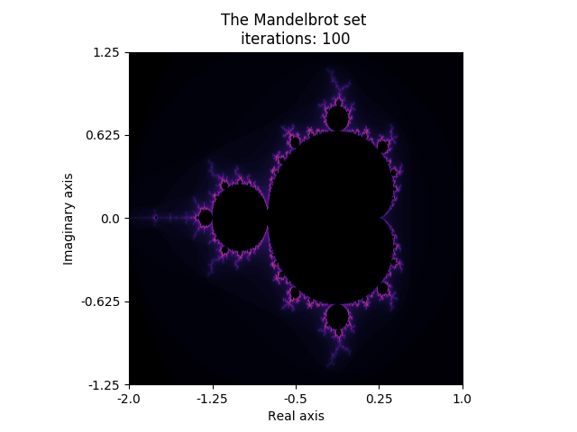

# StochasticSimulation
Programming Assignments for the Stochastic Simulation course in the Master Computational Science at the UvA

# Assignment 1: The Mandelbrot Set
In this assignment, we first explored the mandelbrot set and made some pictures of the never ending fractals. Then, we investigated the convergence of the area with different monte carlo integration methods.

### Pretty pictures
Can be made with running ```python mandelbrot_plots.py```

### Integrations
All the integration files can be found in the integrations folder, and there all six different types of integrations can be performed by runing the right files.
The data can then be found in the data/ folder.

### Plotting
The plots are made with the python scripts that can be found in the results/ folder, and the corresponding figures can then be found in the figures/


# Assignment 2: Discrete Event Simulation
The assignment is divided into four experiments: the 'normal' M/M/n queue, the M/M/n queue with priority scheduling (shortest jobs first), an M/D/n queue with a deterministic job-lenght of 1 and an M/LT/n queue with a job-lenght distribution of 75% percent around 1 and 25% around 5.

### Running the code
Bash scripts were written to perform all the simulations and can be found in the first folder. The data it produces can be found in the data/ folder.

### Results
The plots, that can be found in the figures/ folder, can be produced by (for example) running ```python plots.py``` inside the results/ folder.

Results include average waiting times for different workloads for all experiments.


